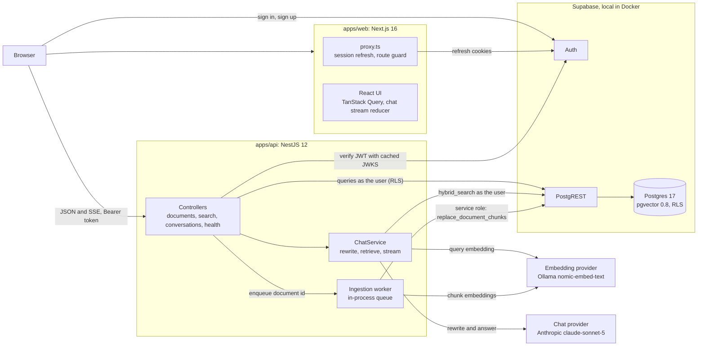

# AI Knowledge Base

[](https://github.com/ali-el-mawla/ai-knowledge-base/actions/workflows/ci.yml)

A knowledge base with a chat that answers only from your own documents. You write or paste Markdown documents, the API splits and embeds them in the background, and the chat answers questions with numbered citations that open the exact passage the answer came from. It is a Turborepo monorepo: a Next.js 16 web app, a NestJS 12 API, shared TypeScript packages, and Supabase (Postgres 17 with pgvector, Auth, Row Level Security). The chat model and the embedding model are separate settings, and each one is swapped by editing `.env`.

**What a user can do**

- Sign up and sign in. Every document, chunk, conversation and message is private to its owner, enforced by the database.
- Create, edit and delete Markdown documents with tags, with a Write / Preview editor. A status badge shows Queued, Indexing, Ready or Failed (with the reason) while the document is indexed in the background.
- Search the document list by text, filter it by tag, and page through it. Filters live in the URL.
- Open the Chunks tab of a document to see exactly how it was split, with the heading path of each chunk.
- Ask questions in a chat with history. Answers stream in, cite sources as `[n]`, and say so when the documents do not cover the question.
- Click a citation to see the passage as it was when the answer was written, its section, how it ranked in semantic and keyword search, and a link to the document.
- Ask follow-ups ("and is it paid?"): the question is rewritten into a standalone search, shown above the answer as "Searched for: ...".
- Stop an answer mid-stream (the partial answer is kept), retry after an error (with a countdown when rate limited), and rename or delete conversations.
- See which chat and embedding models are active, in the chat header.

## Loom walkthrough

TODO: Loom link

## How I used AI

TODO: Loom link

## Contents

- [Loom walkthrough](#loom-walkthrough) and [How I used AI](#how-i-used-ai)
- [Quick start](#quick-start)
- [Architecture](#architecture)
- [Key decisions and why](#key-decisions-and-why)
- [Swapping AI providers](#swapping-ai-providers)
- [Evaluation](#evaluation)
- [Testing and CI](#testing-and-ci)
- [What I would improve with more time](#what-i-would-improve-with-more-time)
- [Known limitations](#known-limitations)
- Deeper docs: [ARCHITECTURE.md](docs/ARCHITECTURE.md), [ADRs](docs/adr/), [API.md](docs/API.md), [TESTING.md](docs/TESTING.md), [EVAL.md](docs/EVAL.md), [fixtures/README.md](fixtures/README.md)

## Quick start

### Prerequisites

| Tool                                                      | Why                                                                                                                                                                  |
| --------------------------------------------------------- | -------------------------------------------------------------------------------------------------------------------------------------------------------------------- |
| [Node.js](https://nodejs.org) 22.12 or newer              | npm ships with it; the repo uses npm workspaces.                                                                                                                     |
| [Docker](https://www.docker.com/products/docker-desktop/) | Supabase runs locally in Docker. The first `supabase start` downloads the Supabase images (a few GB), so the first setup takes several minutes. Later runs are fast. |
| [Ollama](https://ollama.com/download), running            | Local embeddings. Setup pulls `nomic-embed-text` (about 270 MB) if it is missing.                                                                                    |
| An Anthropic API key                                      | For the chat. Any other provider from [the table](#swapping-ai-providers) works too. Without a key, documents and search still work and chat is disabled.            |

### Run it

```bash
git clone https://github.com/ali-el-mawla/ai-knowledge-base.git
cd ai-knowledge-base
npm run setup
```

Then open the root `.env`, set `CHAT_API_KEY` to your Anthropic key, and start both apps:

```bash
npm run dev
```

| URL                              | What                                                  |
| -------------------------------- | ----------------------------------------------------- |
| http://127.0.0.1:3000            | Web app                                               |
| http://127.0.0.1:4000/api/health | API health (`?deep=1` also calls the embedding model) |
| http://127.0.0.1:54323           | Supabase Studio (browse tables, users, policies)      |
| http://127.0.0.1:54324           | Local mail inbox (Mailpit)                            |

**Demo login:** `demo@quaylark.test` / `demo-password-2026`. The account holds 8 documents of a fictional company (about 9,700 words, 127 chunks) created by `npm run seed`, which setup runs. You can also sign up with any email: the local stack does not ask for email confirmation.

### What `npm run setup` does

[`scripts/setup.mjs`](scripts/setup.mjs) uses Node built-ins only, is safe to run again, and never resets the database (only `npm run db:reset` does that).

1. Checks that Node is 22.12 or newer.
2. Runs `npm install`.
3. Creates `.env` from [`.env.example`](.env.example) if it does not exist (an existing `.env` is kept).
4. Checks that Docker is running.
5. Starts the local Supabase stack (`supabase start`, CLI pinned as a devDependency) and fills the empty Supabase URL and key variables in `.env` from `supabase status`. Values you set are never overwritten.
6. Applies the migrations in [`supabase/migrations`](supabase/migrations) (`supabase migration up`).
7. With `EMBEDDING_PROVIDER=ollama`: checks that Ollama answers and pulls the embedding model if needed.
8. Builds the shared packages and the API (`turbo run build --filter=@repo/api...`).
9. Seeds the demo account and the sample corpus through the real ingestion pipeline.
10. Warns if the chat provider has no key yet, then prints the URLs.

Re-running it on a machine that is already set up takes about 10 seconds: every build is a Turborepo cache hit and the seed skips documents that exist.

### Commands

| Command                    | What it does                                                                                                          |
| -------------------------- | --------------------------------------------------------------------------------------------------------------------- |
| `npm run setup`            | Everything above. Idempotent.                                                                                         |
| `npm run dev`              | Web on :3000, API on :4000, shared packages in watch mode (builds the packages first).                                |
| `npm run build`            | Builds every workspace. A second run is a full Turborepo cache hit.                                                   |
| `npm run lint`             | ESLint in every workspace.                                                                                            |
| `npm run typecheck`        | `tsc --noEmit` in every workspace.                                                                                    |
| `npm test`                 | Unit tests in every workspace. No database, no network, no `.env`.                                                    |
| `npm run test:integration` | API integration tests against the local Supabase (real Postgres and RLS, fake AI models, no cost).                    |
| `npm run test:e2e`         | Playwright smoke test through the whole stack (makes one real chat call). Run `npx playwright install chromium` once. |
| `npm run eval`             | Retrieval evaluation, writes [`docs/EVAL.md`](docs/EVAL.md). Needs the embedding model, no chat calls.                |
| `npm run seed`             | Creates the demo user and indexes the sample corpus. Idempotent.                                                      |
| `npm run reembed`          | Re-embeds every document whose chunks were made by another embedding model (or whose ingestion failed).               |
| `npm run db:start`         | Starts the local Supabase stack.                                                                                      |
| `npm run db:stop`          | Stops it (data is kept).                                                                                              |
| `npm run db:migrate`       | Applies new migrations.                                                                                               |
| `npm run db:reset`         | **Destructive.** Drops the local database and replays every migration. Run `npm run seed` afterwards.                 |
| `npm run db:types`         | Regenerates `apps/api/src/database.types.ts` from the local schema.                                                   |
| `npm run format`           | Prettier on the whole repo (`format:check` is what CI runs).                                                          |

### Measured on the author's laptop

Windows 11, Core i7 (11th gen), 16 GB RAM, NVIDIA MX450 with 2 GB. Timings from single runs, 26 Sep 2026.

| What                                               | Result                                                                     |
| -------------------------------------------------- | -------------------------------------------------------------------------- |
| Seeding the 8-document corpus (127 chunks)         | about 18 s, embedded with `nomic-embed-text` on the GPU                    |
| Embedding one question                             | about 0.02 s                                                               |
| Editing one paragraph of a 22-chunk document       | 1 chunk embedded, 21 reused, about 0.36 s                                  |
| Chat with `claude-sonnet-5` (the default)          | first token after about 2 to 3 s, complete answer after about 3.5 to 4.5 s |
| Chat with `claude-haiku-4-5`                       | first token after about 1.4 s, complete answer after about 2.5 s           |
| Chat with `qwen2.5:1.5b` on Ollama (provider swap) | about 75 s for the first call (model load), then about 7 s                 |

## Architecture



The browser uses Supabase for authentication only. All data goes through the API with the user's access token, and the API talks to Postgres through PostgREST with that same token, so Row Level Security applies to every user request. Request flows, the data model and the SSE protocol are in [docs/ARCHITECTURE.md](docs/ARCHITECTURE.md).

### Repository layout

| Path                                                   | What it is                                                                                                        |
| ------------------------------------------------------ | ----------------------------------------------------------------------------------------------------------------- |
| [`apps/web`](apps/web)                                 | Next.js App Router, Tailwind, shadcn/ui, TanStack Query. Code by feature in `src/features/{auth,documents,chat}`. |
| [`apps/api`](apps/api)                                 | NestJS: auth, documents, ingestion, retrieval, chat, health, and the `seed` / `reembed` CLIs.                     |
| [`apps/eval`](apps/eval)                               | Retrieval evaluation: two chunkers crossed with three retrieval modes, hit@k and MRR.                             |
| [`packages/shared`](packages/shared)                   | Contracts used by web and API: zod schemas, DTO types, error codes, the chat SSE encoder and parser.              |
| [`packages/ai`](packages/ai)                           | `ChatModel` and `EmbeddingModel` interfaces, one OpenAI-compatible implementation of each, provider presets.      |
| [`packages/rag`](packages/rag)                         | Pure RAG logic: the Markdown and fixed-size chunkers, chunk headers and hashes, prompt builder, citation parser.  |
| `packages/typescript-config`, `packages/eslint-config` | Shared compiler and lint settings.                                                                                |
| [`supabase`](supabase)                                 | `config.toml` for the local stack and the forward-only SQL migrations.                                            |
| [`fixtures`](fixtures)                                 | The sample corpus (a fictional company) and the evaluation question format and checker.                           |
| [`scripts`](scripts)                                   | `setup.mjs` and `gen-types.mjs`.                                                                                  |
| [`docs`](docs)                                         | Architecture, ADRs, API reference, testing, evaluation report.                                                    |
| [`.github/workflows/ci.yml`](.github/workflows/ci.yml) | CI: format, lint, typecheck, unit tests and build; migrations from zero and the API integration tests.            |

## Key decisions and why

Each section is short. Where one links an ADR, the ADR has the context and the trade-offs.

### Monorepo: npm workspaces, Turborepo, compiled internal packages

npm ships with Node, so a reviewer installs nothing extra. Turborepo runs `build`, `lint`, `typecheck` and `test` in dependency order and caches them; a second `npm run build` is a full cache hit. The shared packages are compiled with `tsc` to `dist` because Nest runs the compiled API on Node, so everything it imports at runtime must be JavaScript; one compiled output then works for both Next.js and Nest. ESM everywhere, one root `.env` for both apps, Vitest for every test suite. [ADR 0001](docs/adr/0001-npm-workspaces-and-compiled-packages.md)

### Security: the database is the source of truth

- **RLS on every table**, one policy per operation, comparing `(select auth.uid())` with `user_id` (evaluated once per statement, not per row).
- **The API queries as the user.** Each request gets a supabase-js client carrying the caller's JWT, so a bug in the API cannot return another user's rows. The JWT is verified locally against the Supabase JWKS (algorithms pinned, issuer and audience checked).
- **Column grants** are the second layer: users can write only `title`, `content` and `tags` of a document, only the `title` of a conversation, and nothing on chunks. They cannot mark their own document `ready` or change its version, even by calling PostgREST directly.
- **Users cannot write assistant messages** (the insert policy requires `role = 'user'`). Otherwise a user could plant fake answers that later go back into the prompt as history.
- **The secret key is used narrowly:** the ingestion worker, the CLIs, the boot and health checks, and two writes users are not granted (saving the assistant answer, bumping the version on reindex). Those two run only after ownership was proven with the user's own client, and filter by owner again. `replace_document_chunks` cannot be executed by signed-in users at all.
- **Another user's id answers 404, never 403**, so ids cannot be probed.
- **Composite foreign keys** `(document_id, user_id)` and `(conversation_id, user_id)`: a chunk or message can never point at a parent owned by someone else.

[ADR 0002](docs/adr/0002-security-model-rls-first.md)

### Ingestion: asynchronous, versioned, incremental

Saving a document returns at once; the document id goes into an in-process queue that coalesces by id (a burst of edits is one job) and runs one job at a time. A database trigger bumps `content_version` and resets the status on any title or content change, so tag-only edits never re-embed. Each chunk has a SHA-256 hash of (model, dimensions, prefix, header, text); only new hashes are embedded, and unchanged vectors are copied inside SQL. `replace_document_chunks` swaps the whole chunk generation in one transaction and writes nothing if the document changed meanwhile, so the latest edit always wins and readers never see a half-written document. On boot the worker requeues anything left `pending` or `processing`. [ADR 0003](docs/adr/0003-async-ingestion-with-versioned-generations.md)

### Chunking: structure first, then size

- **Heading-aware:** the Markdown is parsed with the `marked` lexer; every heading starts a new section and chunks never mix two sections. The heading path (`Leave > Parental leave`) travels with each chunk.
- **Target about 1,200 characters:** whole blocks (paragraphs, lists, code, tables) are merged until the next one would pass the target, so a chunk holds a few paragraphs about one topic, enough context for an answer and still specific enough to rank.
- **Hard limit 2,000 characters, header included.** `nomic-embed-text` under Ollama reads at most 2,048 tokens and silently truncates the rest (checked on Ollama 0.34.4: two inputs that differ only after that point get identical vectors). 2,000 characters is roughly 500 tokens, far below it, so no chunk is ever cut invisibly.
- **Overlap only inside a split section:** when one section needs several chunks, each new chunk starts with the last sentences (up to 200 characters) of the previous one. Never across headings, which would mix two topics.
- **Code blocks and tables stay whole** when they fit the hard limit, even above the target. A block too big alone is split by lines with its fence or header rows repeated, so every piece is valid Markdown.
- **Contextual header:** each chunk is embedded as `Document title > heading path` plus its text. "Limits: 120 USD per attendee" is ambiguous; under `Travel and Expense Policy > Meals > Limits` it is not. This is a free, deterministic form of contextual retrieval.

On the demo corpus the structure-aware chunker produces 127 chunks (the naive baseline 67); most sections are shorter than the target, so the average chunk is about 490 characters and the largest about 1,590. [ADR 0004](docs/adr/0004-structure-aware-chunking.md)

### Embeddings

`nomic-embed-text` through Ollama: 768 dimensions, local, free, and documents never leave the machine. The model is trained with task prefixes, so the `EmbeddingModel` adds `search_document: ` to stored text and `search_query: ` to questions based on the call's purpose. Documents and questions must use the same model; every chunk stores the model that embedded it and retrieval only searches chunks of the configured model. At boot the API compares `EMBEDDING_DIMENSIONS` with the `vector(768)` column and refuses to start on a mismatch, with the fix in the message. After a model change, `npm run reembed` rebuilds what is stale.

### Retrieval: hybrid search fused with RRF

- **Two arms in one SQL function** (`hybrid_search`, `security invoker`, so RLS applies): cosine similarity over an HNSW index, and Postgres full-text search over a generated `tsvector` where the title and heading path weigh more than the body.
- **Why both:** vectors find meaning ("time off after a baby" finds parental leave); keywords find exact codes vectors blur (`PLN-GROWTH-24`, `SEV2`).
- **Reciprocal Rank Fusion, k = 60:** a chunk scores `1 / (60 + rank)` in each list it appears in. Ranks are fused, not raw scores, because cosine distance and `ts_rank_cd` live on different scales. k = 60 is the value from Cormack et al. (2009); it keeps a chunk that both arms rank well above one that only one arm ranks first.
- **The keyword query is an OR of the question's lexemes.** `websearch_to_tsquery` ANDs every word, so a natural question matches almost nothing and hybrid quietly becomes vector-only. ORing the stemmed words and ranking with `ts_rank_cd` rewards chunks that contain more of them, closer together.
- **HNSW with `hnsw.iterative_scan = relaxed_order`** (pgvector 0.8): RLS and the model filter run after the index scan, and without iterative scanning a user could get fewer results than asked.
- **Deterministic ties:** every sort ends with the chunk's content hash. The evaluation caught keyword ties that reordered results between runs.
- **Sizes:** 30 candidates per arm (under pgvector's default `ef_search` of 40, so one index pass fills it) and 6 sources to the model.

[ADR 0005](docs/adr/0005-hybrid-retrieval-with-rrf.md)

### Chat: a fixed RAG workflow with streaming

- **History comes from the database** (the last 6 finished messages), never from the browser, so a client cannot put words in the assistant's mouth.
- **Only follow-ups are rewritten** into a standalone question, by `REWRITE_MODEL` (defaults to the chat model, temperature 0). If the rewrite fails or looks like an answer, the raw question is used: a worse search beats no answer. The rewrite is for retrieval only; the model answers the question as the user asked it.
- **Prompt order:** rules as the system message, then recent turns, then one user message with the numbered sources first and the question last (Anthropic's long-context advice).
- **Sources are untrusted data:** each sits in a `<source index="n" ...>` tag, the rules say text inside a source is never an instruction, titles and headings are escaped as attributes, and any `<source>` or `</sources>` tag inside chunk text is neutralized so a document cannot close its own tag. Old `[n]` markers are stripped from earlier answers before they re-enter the prompt.
- **Citations are validated by the server:** numbers outside the sources given are dropped, and the answer is saved with a snapshot of its sources, so citations still open the right text after the document changes.
- **SSE over `fetch`:** `EventSource` can only send GET requests without an `Authorization` header. Auth, validation, ownership and the rate limit (20 messages per minute per user) run before the first byte, so their failures are normal JSON errors.
- **Stop really stops:** closing the connection aborts the upstream model call, and the partial answer (if any text was generated) is saved with status `aborted`.

[ADR 0007](docs/adr/0007-sse-over-fetch.md)

### Agent or workflow?

This is a **workflow** on purpose: the steps are fixed (rewrite if needed, retrieve, answer, validate) and the code, not the model, decides what runs next. For questions over one document store that is cheaper (one or two model calls), faster, predictable, and easy to evaluate step by step. An **agent** lets the model choose its own tools and steps in a loop. It becomes the right tool when there are several sources with different access patterns, for example searching these documents, querying a SQL database of orders, or calling a ticketing API, and the right sequence depends on the question. Even then I would keep retrieval as one well-tested tool and add a step budget and tracing.

### Local-first and cost control

Local Supabase, local embeddings and fake models in the integration tests mean the whole system runs and is tested without paying for anything except chat answers. Chat uses a small model with capped output (1,024 tokens per answer, 120 per rewrite), rewrites happen only on follow-ups, keyword-only search skips the embedding call, and token usage is stored on every assistant message. [ADR 0008](docs/adr/0008-local-first-and-cost-control.md)

## Swapping AI providers

There are two independent slots, each configured in the root `.env`:

- **Chat** (`CHAT_*`, plus optional `REWRITE_MODEL`): answers and follow-up rewriting. Any provider in the table.
- **Embeddings** (`EMBEDDING_*`): chunks and questions. Must stay the same for documents and queries.

**How the abstraction works** ([`packages/ai`](packages/ai/src), [ADR 0006](docs/adr/0006-provider-agnostic-ai-layer.md)):

- The app depends on two interfaces only, with neutral types (no OpenAI SDK types leak out): `ChatModel` with `complete()` and `stream()` (an async iterable of `delta`, `usage` and `finish` parts), and `EmbeddingModel` with `embed(texts, purpose)` where `purpose` is `document` or `query`.
- One implementation of each speaks the OpenAI API format, which all the presets accept. [`factory.ts`](packages/ai/src/factory.ts) is the only place that picks an implementation; the API injects the models through Nest tokens, and tests replace them with fakes.
- **Provider differences are data, not code.** [`presets.ts`](packages/ai/src/presets.ts) holds each provider's base URL, whether it needs a key, and capability flags: the name of the max-tokens field, the temperature range, whether streamed usage must be requested, whether embeddings accept `dimensions`, and the batch size. The model classes contain no `if (provider === ...)`. Each preset cites the provider documentation its flags were checked against.
- **Errors are normalized** to a few kinds (`auth`, `rate_limit`, `timeout`, `context_length`, `unavailable`, `bad_request`, `invalid_response`, with `retryable`), which the API maps to safe messages: `AI_PROVIDER_ERROR` (502) for chat, `EMBEDDING_UNAVAILABLE` (503) for embeddings.
- The API starts without a chat key: documents and search work, `POST /conversations/:id/messages` answers `503 CHAT_NOT_CONFIGURED`, and `/api/health` says why.

**To swap:** edit `.env`, then restart `npm run dev`. Nothing else changes.

| Provider                             | Chat        | Embeddings                |
| ------------------------------------ | ----------- | ------------------------- |
| `anthropic`                          | verified    | none offered              |
| `ollama`                             | verified    | verified (default)        |
| `openai`                             | config only | config only               |
| `groq`                               | config only | none offered              |
| `together`                           | config only | preset exists, not tested |
| `openrouter`                         | config only | preset exists, not tested |
| `custom` (any OpenAI-compatible URL) | config only | config only               |

"Verified" means I ran the app end to end with it. "Config only" means the preset's flags were checked against the provider's documentation but I have not run it.

**Chat**

```bash
# Anthropic (verified, the default)
CHAT_PROVIDER=anthropic
CHAT_MODEL=claude-sonnet-5
REWRITE_MODEL=claude-haiku-4-5
CHAT_API_KEY=<your Anthropic key>

# Ollama, fully local (verified; run `ollama pull qwen2.5:1.5b` first)
CHAT_PROVIDER=ollama
CHAT_MODEL=qwen2.5:1.5b
CHAT_API_KEY=

# OpenAI (config only)
CHAT_PROVIDER=openai
CHAT_MODEL=gpt-4.1-mini
CHAT_API_KEY=<your OpenAI key>

# Groq (config only)
CHAT_PROVIDER=groq
CHAT_MODEL=llama-3.3-70b-versatile
CHAT_API_KEY=<your Groq key>

# Together (config only)
CHAT_PROVIDER=together
CHAT_MODEL=meta-llama/Llama-3.3-70B-Instruct-Turbo
CHAT_API_KEY=<your Together key>

# OpenRouter (config only)
CHAT_PROVIDER=openrouter
CHAT_MODEL=anthropic/claude-haiku-4.5
CHAT_API_KEY=<your OpenRouter key>

# Any other OpenAI-compatible server (config only)
CHAT_PROVIDER=custom
CHAT_BASE_URL=http://127.0.0.1:8000/v1
CHAT_MODEL=<model name>
```

Optional: `REWRITE_MODEL=<a smaller model of the same provider>` for follow-up rewriting. Optional: `CHAT_TEMPERATURE` (0 to 2) is sent only when set, because newer models such as `claude-sonnet-5` and OpenAI's reasoning models reject the parameter (found when switching the default to Sonnet 5).

**Embeddings**

```bash
# Ollama (verified, the default)
EMBEDDING_PROVIDER=ollama
EMBEDDING_MODEL=nomic-embed-text
EMBEDDING_DIMENSIONS=768
EMBEDDING_API_KEY=
EMBEDDING_DOCUMENT_PREFIX="search_document: "
EMBEDDING_QUERY_PREFIX="search_query: "

# OpenAI (config only): shortened to 768 dimensions to fit the column; no task prefixes
EMBEDDING_PROVIDER=openai
EMBEDDING_MODEL=text-embedding-3-small
EMBEDDING_DIMENSIONS=768
EMBEDDING_API_KEY=<your OpenAI key>
EMBEDDING_DOCUMENT_PREFIX=
EMBEDDING_QUERY_PREFIX=
```

**What happens when the embedding model changes**

1. At boot, the API reads the column size through `embedding_dimensions()`. If `EMBEDDING_DIMENSIONS` differs, it refuses to start and prints both fixes: a model with that size, or a migration that changes the column (the column, its HNSW index and `hybrid_search` are all typed `vector(768)`).
2. A model that returns vectors of the wrong length fails its first call with a message naming `EMBEDDING_DIMENSIONS`.
3. With a new model of the same size, the API starts, but retrieval only searches chunks made by the configured model, so old vectors are never compared with new ones. `GET /api/ai/info` counts the stale chunks and the chat header tooltip says to re-embed.
4. `npm run reembed` finds, for every user, the documents with chunks from another model (and the ones whose ingestion failed), bumps their version and indexes them again. The model is part of every chunk hash, so no old vector is reused by mistake.

**Honest notes from the swap test**

- **Anthropic's OpenAI-compatible endpoint** is what makes Claude work through the same class. Anthropic's own documentation says this layer "is not considered a long-term or production-ready solution for most use cases", and it does not support prompt caching. The production path is a native Anthropic `ChatModel` next to the OpenAI-compatible one, chosen in `factory.ts`; no caller would change.
- **Ollama with `qwen2.5:1.5b`** answered the test question correctly with only `.env` changed, but did not emit `[n]` citations. Citation following needs a stronger model; the server-side validation simply stores no citations in that case.
- **Presets are per provider, not per model.** The answer call sends temperature 0.2 and the rewrite call 0. OpenAI's reasoning models (the `gpt-5` family) only accept the default temperature, which is why the OpenAI example uses `gpt-4.1-mini`. Per-model capability flags are on the improvement list.

## Evaluation

`npm run eval` ([`apps/eval`](apps/eval)) measures retrieval, not generation. Each question names the document that answers it and a short answer span copied word for word from it. The corpus is indexed twice, with the structure-aware chunker and a naive fixed-size baseline (each under its own user, so RLS keeps them apart), and every question runs through the same `hybrid_search` in vector, keyword and hybrid mode. A hit is a retrieved chunk from the right document that contains the span; the report gives hit@1, hit@3, hit@5 and MRR@10 per combination. It makes no chat calls, so it costs nothing to rerun.

The 40 questions in [`fixtures/questions.json`](fixtures/questions.json) (5 per document, six question types) were generated with Claude (an LLM) from the corpus, deliberately paraphrased away from the document wording, and every answer span is checked verbatim by `fixtures/verify-questions.mjs`. LLM-generated questions can still share vocabulary with the source and flatter semantic search, and they come from a single generator.

| Chunking         | Retrieval | hit@1       | hit@3       | hit@5       | MRR@10 |
| ---------------- | --------- | ----------- | ----------- | ----------- | ------ |
| Structure-aware  | vector    | 27/40 (68%) | 34/40 (85%) | 35/40 (88%) | 0.758  |
| Structure-aware  | keyword   | 22/40 (55%) | 30/40 (75%) | 31/40 (78%) | 0.665  |
| Structure-aware  | hybrid    | 26/40 (65%) | 36/40 (90%) | 38/40 (95%) | 0.770  |
| Naive fixed-size | vector    | 19/40 (48%) | 32/40 (80%) | 35/40 (88%) | 0.645  |
| Naive fixed-size | keyword   | 17/40 (43%) | 25/40 (63%) | 27/40 (68%) | 0.555  |
| Naive fixed-size | hybrid    | 19/40 (48%) | 32/40 (80%) | 37/40 (93%) | 0.633  |

Structure-aware chunking wins mostly at the top of the list: with hybrid it puts the answer first for 26 of 40 questions against 19 for the naive baseline (MRR 0.770 against 0.633), while hit@5 is close (38 against 37). Hybrid is the best mode on this set by hit@5 and MRR, but only modestly ahead of vector-only (38/40 against 35/40 at hit@5, and one question behind at hit@1), and keyword alone is last in both strategies. On structure-aware chunks the fusion cuts both ways on exact codes: it rescues the SEV3 question that vector search misses entirely (rank 3 instead of outside the top 10), but it buries the EXP-TRV-06 question that keyword search ranks first, because with equal weights a chunk found by only one arm scores at most 1/61 while any chunk found by both arms scores at least 2/90.

The full report, with hit@5 per question type, per-question ranks, misses and limitations, is [docs/EVAL.md](docs/EVAL.md).

## Testing and CI

| Suite                | Command                    | Tests                                                    | Needs                                  |
| -------------------- | -------------------------- | -------------------------------------------------------- | -------------------------------------- |
| Unit                 | `npm test`                 | 552: api 195, web 128, rag 111, ai 86, eval 28, shared 4 | nothing                                |
| API integration      | `npm run test:integration` | 87, plus 1 live-provider test skipped unless `LIVE_AI=1` | local Supabase                         |
| End-to-end smoke     | `npm run test:e2e`         | 1 Playwright journey                                     | the whole stack and a chat key         |
| Retrieval evaluation | `npm run eval`             | see [Evaluation](#evaluation)                            | local Supabase and the embedding model |

- **Unit tests** cover the chunkers, headers and hashes, prompt builder and citation parser; provider config, presets and both model clients against a fake `fetch`; the SSE codec; the API's guards, filters, pipes, chat, ingestion and retrieval services; the web's stream reducer and hook, citation rendering, composer, forms and API client.
- **Integration tests** boot the real Nest app against the real local Postgres with its migrations and RLS, create real users with real tokens, and use fake AI models. They cover auth (missing, malformed and forged tokens), the error contract, CRUD, RLS with two users (including `replace_document_chunks` denied to signed-in users and assistant messages denied to users), ingestion (incremental re-embedding, concurrent edits, failures, the reembed path) and the chat stream (events, saved answers, rewriting, disconnects).
- **CI** ([`ci.yml`](.github/workflows/ci.yml)) runs two jobs on every push to `main` and every pull request: `checks` (Prettier, then `turbo run lint typecheck test build`) and `database` (starts Supabase in Docker, which applies every migration to an empty database, then runs the integration tests). The e2e test and the eval stay local because they need real models.

Details: [docs/TESTING.md](docs/TESTING.md).

## What I would improve with more time

In priority order:

1. **A durable job queue.** Replace the in-process queue with pgmq or pg-boss in the same Postgres: retries with backoff, a dead-letter state, several workers, and ingestion moved out of the API process so it scales on its own. The database is already the source of truth (statuses and versions), so the worker contract stays the same.
2. **A reranker or weighted fusion, measured with this harness.** With hybrid on structure-aware chunks, 12 of the 40 answers sit at ranks 2 to 5 (hit@1 26/40, hit@5 38/40), and equal-weight RRF can push a keyword-only first hit out of the top 10 (the EXP-TRV-06 question). Rerank the fused top 20 to 30 with a cross-encoder before taking 6, or weight the arms, and keep the change only if `npm run eval` shows it helps.
3. **A native Anthropic adapter, then LLM contextual retrieval.** A native `ChatModel` unlocks prompt caching. With caching, an LLM can write a short context line for every chunk (the full version of today's title and heading header) at a fraction of the cost.
4. **Observability.** Trace each chat turn by step (rewrite, embed, search, generate) with timings and token counts, and build a cost view per user and model from the usage already stored on every assistant message.
5. **Scaling.** A shared store (Redis) for rate limits, which live in each API process today; per-plan limits; connection pooling in front of Postgres and read replicas for search; caching query embeddings for repeated questions; tuning HNSW (`ef_search`, `m`) against the evaluation as the corpus grows.
6. **Per-model capability flags** in the presets, for models that reject parameters their provider accepts (reasoning models and temperature).
7. **Workload identity federation** instead of static API keys when deployed on a cloud platform: short-lived credentials from the platform's identity, nothing long-lived in `.env`.
8. **PDF and TXT upload**, through Supabase Storage and text extraction; the chunker already accepts plain text.
9. **Resumable streams.** Keep generating when the tab closes and let the client reconnect to a running answer (`Last-Event-ID`), instead of saving the partial answer as stopped.
10. **Multi-tenant sharing.** Organizations and memberships, with RLS policies through the membership table, so a team can share documents.

## Known limitations

- The ingestion queue lives in memory and runs one job at a time. A restart loses nothing (unfinished documents are requeued from the database), but it does not spread over several API instances. The same goes for the rate limiter.
- Keyword search uses the English text-search configuration. Answers follow the language of the question, but keyword matching in other languages is weaker.
- Documents are Markdown or plain text typed or pasted into the editor; there is no file upload.
- Chat through Anthropic uses its OpenAI-compatible layer: no prompt caching, and Anthropic does not position it for production.
- Small local chat models may ignore the citation format.
- `npm run reembed` detects a changed embedding model by name. Changing only the prefixes changes the chunk hashes, so the next edit or a Reindex re-embeds that document, but `reembed` does not pick it up by itself. Changing the dimension needs a migration.
- The conversation sidebar shows the 200 most recent conversations, without paging.
- The evaluation set is small (40 questions) and was generated with Claude from the corpus, so it can share vocabulary with the documents; it measures retrieval, not answer quality.
- A dropped connection ends the answer: the partial text is saved as stopped and the user retries.
