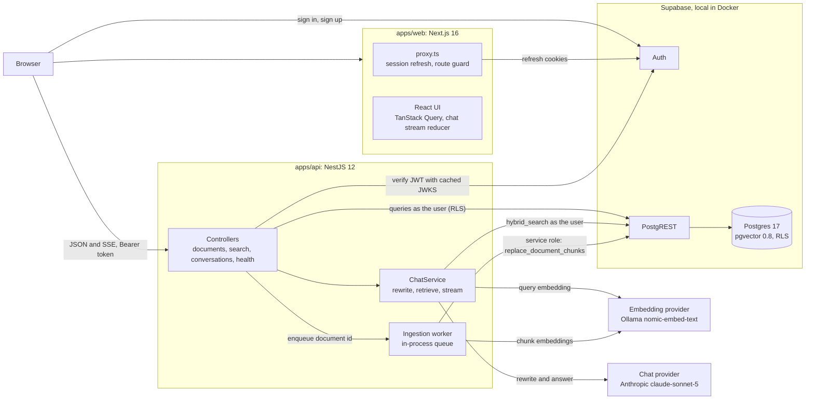

# AI Knowledge Base

[](https://github.com/ali-el-mawla/ai-knowledge-base/actions/workflows/ci.yml)

A knowledge base whose chat answers only from your own documents, with numbered citations that open the exact passage used. Documents are Markdown, chunked and embedded in the background. It is a Turborepo monorepo: a Next.js 16 web app, a NestJS 12 API, shared TypeScript packages, and Supabase (Postgres 17 with pgvector, Auth, Row Level Security). The chat model and the embedding model are set separately in `.env`.

Features:

- Sign-up and sign-in. Every document and conversation is private to its owner, enforced by the database.
- A Markdown editor with tags and preview. A badge shows Queued, Indexing, Ready or Failed (with the reason), and a Chunks tab shows how the document was split.
- A text filter over titles and content, a tag filter and paging, kept in the URL.
- Streaming chat with history and `[n]` citations. When the documents do not cover a question, the answer says so. Follow-ups ("and is it paid?") are rewritten into a standalone search, shown as "Searched for: ...".
- A citation opens the passage as it was when the answer was written, with its section, its semantic and keyword ranks, and a link to the document.
- Stop mid-answer (the partial text is kept), retry (with a countdown when rate limited), rename and delete conversations. The chat header shows the active models, and each answer shows its model and token usage.

## Contents

- [Quick start](#quick-start)
- [Architecture](#architecture)
- [Key decisions and why](#key-decisions-and-why)
- [Swapping AI providers](#swapping-ai-providers)
- [Evaluation](#evaluation)
- [Testing and CI](#testing-and-ci)
- [How I built it](#how-i-built-it)
- [Roadmap](#roadmap)
- [Known limitations](#known-limitations)
- [Author](#author)
- Deeper docs: [ARCHITECTURE.md](docs/ARCHITECTURE.md), [ADRs](docs/adr/), [API.md](docs/API.md), [TESTING.md](docs/TESTING.md), [EVAL.md](docs/EVAL.md), [fixtures/README.md](fixtures/README.md)

## Quick start

### Prerequisites

| Tool                                                      | Why                                                                                                                               |
| --------------------------------------------------------- | --------------------------------------------------------------------------------------------------------------------------------- |
| [Node.js](https://nodejs.org) 22.12 or newer              | npm ships with it; the repo uses npm workspaces.                                                                                  |
| [Docker](https://www.docker.com/products/docker-desktop/) | Runs Supabase locally. The first `supabase start` downloads a few GB of images, so the first setup takes several minutes.         |
| [Ollama](https://ollama.com/download), running            | Local embeddings. Setup pulls `nomic-embed-text` (about 270 MB) if it is missing.                                                 |
| An Anthropic API key                                      | For the chat, or any provider from [the table](#swapping-ai-providers). Without a key, documents and search work and chat is off. |

No Ollama? Before `npm run setup`, copy `.env.example` to `.env` and switch it to the [OpenAI embedding settings](#embedding-settings).

### Run it

```bash
git clone https://github.com/ali-el-mawla/ai-knowledge-base.git
cd ai-knowledge-base
npm run setup
```

Then set `CHAT_API_KEY` in the root `.env` to your Anthropic key and start both apps:

```bash
npm run dev
```

| URL                              | What                                                  |
| -------------------------------- | ----------------------------------------------------- |
| http://127.0.0.1:3000            | Web app                                               |
| http://127.0.0.1:4000/api/health | API health (`?deep=1` also calls the embedding model) |
| http://127.0.0.1:54323           | Supabase Studio (browse tables, users, policies)      |
| http://127.0.0.1:54324           | Local mail inbox (Mailpit)                            |

If another local Supabase project is running on the same ports, stop it first (`npx supabase stop --project-id <other>`), or `supabase start` fails with "port is already allocated".

**Demo login:** `demo@quaylark.test` / `demo-password-2026`, with 8 documents of a fictional company (about 9,700 words, 127 chunks) seeded by setup. You can also sign up with any email; the local stack skips email confirmation.

[`.env.example`](.env.example) documents every variable. One `.env` at the root serves both apps.

### What `npm run setup` does

[`scripts/setup.mjs`](scripts/setup.mjs) is safe to rerun (about 10 seconds once set up: builds are cache hits and the seed skips existing documents) and never resets the database. It:

1. Checks Node (22.12 or newer) and runs `npm install`.
2. Creates `.env` from `.env.example` if there is none.
3. With `EMBEDDING_PROVIDER=ollama`, checks that Ollama answers and pulls the embedding model if it is missing, so a missing Ollama stops setup before the slow Supabase start.
4. Checks Docker, starts local Supabase (CLI pinned as a devDependency), fills the empty Supabase variables from `supabase status` without overwriting yours, and applies the migrations.
5. Builds the API and its packages, seeds the demo account through the real ingestion pipeline, and warns if the chat key is missing.

### Commands

| Command                    | What it does                                                                                                          |
| -------------------------- | --------------------------------------------------------------------------------------------------------------------- |
| `npm run setup`            | Everything above. Idempotent.                                                                                         |
| `npm run dev`              | Web on :3000, API on :4000, shared packages in watch mode (builds the packages first).                                |
| `npm run build`            | Builds every workspace. A second run is a full Turborepo cache hit.                                                   |
| `npm run lint`             | ESLint in every workspace.                                                                                            |
| `npm run typecheck`        | `tsc --noEmit` in every workspace.                                                                                    |
| `npm test`                 | Unit tests in every workspace. No database, no network, no `.env`.                                                    |
| `npm run test:integration` | API integration tests against the local Supabase (real Postgres and RLS, fake AI models, no cost).                    |
| `npm run test:e2e`         | Playwright smoke test through the whole stack (makes one real chat call). Run `npx playwright install chromium` once. |
| `npm run eval`             | Retrieval evaluation, writes [`docs/EVAL.md`](docs/EVAL.md). Needs the embedding model, no chat calls.                |
| `npm run seed`             | Creates the demo user and indexes the sample corpus. Idempotent.                                                      |
| `npm run reembed`          | Re-embeds every document whose chunks were made by another embedding model (or whose ingestion failed).               |
| `npm run db:start`         | Starts the local Supabase stack.                                                                                      |
| `npm run db:stop`          | Stops it (data is kept).                                                                                              |
| `npm run db:migrate`       | Applies new migrations.                                                                                               |
| `npm run db:reset`         | **Destructive.** Drops the local database and replays every migration. Run `npm run seed` afterwards.                 |
| `npm run db:types`         | Regenerates `apps/api/src/database.types.ts` from the local schema.                                                   |
| `npm run format`           | Prettier on the whole repo (`format:check` is what CI runs).                                                          |

### Measured on the author's laptop

Windows 11, Core i7 (11th gen), 16 GB RAM, NVIDIA MX450 with 2 GB. Timings from single runs, 26 Sep 2026.

| What                                               | Result                                                                     |
| -------------------------------------------------- | -------------------------------------------------------------------------- |
| Seeding the 8-document corpus (127 chunks)         | about 18 s, embedded with `nomic-embed-text` on the GPU                    |
| Embedding one question                             | about 0.02 s                                                               |
| Editing one paragraph of a 22-chunk document       | 1 chunk embedded, 21 reused, about 0.36 s                                  |
| Chat with `claude-sonnet-5` (the default)          | first token after about 2 to 3 s, complete answer after about 3.5 to 4.5 s |
| Chat with `claude-haiku-4-5`                       | first token after about 1.4 s, complete answer after about 2.5 s           |
| Chat with `qwen2.5:1.5b` on Ollama (provider swap) | about 75 s for the first call (model load), then about 7 s                 |

## Architecture



The browser uses Supabase for authentication only. All data goes through the API with the user's access token, and the API reaches Postgres through PostgREST with that same token, so Row Level Security applies to every user request. Request flows, the data model and the SSE protocol are in [docs/ARCHITECTURE.md](docs/ARCHITECTURE.md).

There are two kinds of search. The search box on the documents page is a deliberate substring filter over titles and content (`GET /api/documents?q=`), for finding a document by name or a phrase you remember. `POST /api/search` is the retrieval the chat uses (hybrid by default, or one arm alone); it is exposed for debugging and evaluation and has no dedicated UI. See [docs/API.md](docs/API.md#two-kinds-of-search).

### Repository layout

| Path                                 | What it is                                                                                  |
| ------------------------------------ | ------------------------------------------------------------------------------------------- |
| [`apps/web`](apps/web)               | Next.js App Router, Tailwind, shadcn/ui, TanStack Query; code by feature in `src/features`. |
| [`apps/api`](apps/api)               | NestJS: auth, documents, ingestion, retrieval, chat, health, the `seed` and `reembed` CLIs. |
| [`apps/eval`](apps/eval)             | Retrieval evaluation.                                                                       |
| [`packages/shared`](packages/shared) | Zod schemas, DTO types, error codes and the SSE codec, used by web and API.                 |
| [`packages/ai`](packages/ai)         | Chat and embedding interfaces, one OpenAI-compatible implementation, provider presets.      |
| [`packages/rag`](packages/rag)       | Chunkers, chunk headers and hashes, prompt builder, citation parser. No I/O.                |
| [`supabase`](supabase)               | Local stack config and forward-only SQL migrations.                                         |
| [`fixtures`](fixtures)               | The sample corpus (a fictional company) and the evaluation questions.                       |

## Key decisions and why

### Monorepo: npm workspaces, Turborepo, compiled packages

npm workspaces need nothing beyond Node, and Turborepo runs build, lint, typecheck and test in dependency order with caching. The shared packages compile with `tsc` to `dist` because Nest runs the compiled API on Node; the same output serves Next.js. [ADR 0001](docs/adr/0001-npm-workspaces-and-compiled-packages.md)

### Security: the database enforces ownership

Every table has RLS, and the API queries PostgREST with the caller's JWT (verified locally against the Supabase JWKS), so an API bug cannot return another user's rows. Column grants add a second layer: users can write only a document's `title`, `content` and `tags` and a conversation's `title`, so they cannot mark their own document `ready`. Users can only insert messages with `role = 'user'`, so nobody can plant fake answers that later re-enter the prompt. The secret key is limited to the worker, the CLIs, boot and health checks, and two writes (saving the answer, the reindex version bump) made after ownership is proven with the user's client. Another user's id answers 404, never 403. [ADR 0002](docs/adr/0002-security-model-rls-first.md)

### Ingestion: asynchronous, versioned, incremental

Saving returns at once, and an in-process queue indexes documents one at a time, coalescing repeated ids. A trigger bumps `content_version` only when the title or content changes, so tag edits never re-embed, and only chunks whose hash is new get embedded. `replace_document_chunks` swaps a document's chunks in one transaction and writes nothing if the document changed meanwhile, so the latest edit wins and search never sees a half-indexed document. [ADR 0003](docs/adr/0003-async-ingestion-with-versioned-generations.md)

### Chunking: structure first, then size

Every heading starts a section, chunks never mix sections, and whole blocks (paragraphs, lists, code, tables) are merged up to about 1,200 characters. The hard limit is 2,000 characters, about 500 tokens, because `nomic-embed-text` under Ollama silently truncates input past 2,048 tokens (checked on Ollama 0.34.4). Each chunk is embedded under a `Document title > heading path` header: "Limits: 120 USD per attendee" is ambiguous, but not under `Travel and Expense Policy > Meals > Limits`. The demo corpus gives 127 chunks (the naive baseline: 67), about 490 characters on average. [ADR 0004](docs/adr/0004-structure-aware-chunking.md)

### Retrieval: hybrid search fused with RRF

`hybrid_search` is one SQL function (`security invoker`, so RLS applies) with two arms: cosine similarity over HNSW finds meaning ("time off after a baby" finds parental leave), and Postgres full-text search finds exact codes that vectors blur (`PLN-GROWTH-24`). Reciprocal Rank Fusion with k = 60 (Cormack et al., 2009) merges them by rank, because cosine distance and `ts_rank_cd` are on different scales. The keyword query ORs the question's stemmed words, because `websearch_to_tsquery` ANDs them and a natural question would match almost nothing. With `hnsw.iterative_scan = relaxed_order` the index keeps scanning until RLS and the model filter leave enough rows, and ties break on the content hash, so results are repeatable. 30 candidates per arm, 6 sources to the model. [ADR 0005](docs/adr/0005-hybrid-retrieval-with-rrf.md)

### Chat: a fixed RAG workflow with streaming

- History (the last 6 finished messages) comes from the database, never from the browser, so a client cannot put words in the assistant's mouth.
- Only follow-ups are rewritten into a standalone search query. If the rewrite fails, the raw question is searched, and the model always answers the question as asked.
- Sources are untrusted data: each sits in an escaped `<source index="n">` tag, source tags inside chunk text are neutralized, and the rules say text inside a source is never an instruction.
- The server drops citation numbers outside the given sources and saves each answer with a snapshot of its sources, so citations open the right text after the document changes.
- SSE over `fetch`, because `EventSource` cannot POST or send an `Authorization` header. Auth, validation and the rate limit (20 messages per minute) run before the first byte, so they fail as normal JSON errors. Stop aborts the model call and saves the partial answer.

[ADR 0007](docs/adr/0007-sse-over-fetch.md)

### Agent or workflow?

A workflow: the steps are fixed (rewrite if needed, retrieve, answer, validate) and the code decides what runs next. Over one document store that is cheaper (one or two model calls), faster, predictable and easy to evaluate step by step. An agent that picks its own tools pays off when several sources need different access (these documents, an orders database, a ticketing API) and the right sequence depends on the question. Even then I would keep retrieval as one tested tool, with a step budget and tracing.

### Local-first and cost control

Supabase and embeddings run locally (documents never leave the machine) and the tests use fake models, so only chat answers cost money. Output is capped at 1,024 tokens per answer and 120 per rewrite, only follow-ups are rewritten (by the smaller `claude-haiku-4-5` with `REWRITE_MODEL` set as in [Chat settings](#chat-settings)), and every answer stores its token usage. [ADR 0008](docs/adr/0008-local-first-and-cost-control.md)

## Swapping AI providers

Chat (`CHAT_*`, optional `REWRITE_MODEL`) and embeddings (`EMBEDDING_*`) are independent slots in the root `.env`. To swap, edit `.env` and restart `npm run dev`; nothing else changes. Documents and questions must use the same embedding model.

[`packages/ai`](packages/ai/src) exposes two interfaces, `ChatModel` and `EmbeddingModel`, with one OpenAI-compatible implementation of each. Provider differences are data in [`presets.ts`](packages/ai/src/presets.ts) (base URL, key requirement, max-tokens field, temperature range, streamed usage, `dimensions` support, batch size), each checked against the provider docs it cites, so no class branches on a provider name. [`factory.ts`](packages/ai/src/factory.ts) is the only place that picks an implementation, and tests inject fakes. Provider errors are normalized to a few kinds with a `retryable` flag and reach the client as `AI_PROVIDER_ERROR` (502) or `EMBEDDING_UNAVAILABLE` (503). Without a chat key the API still starts and chat answers `503 CHAT_NOT_CONFIGURED`. [ADR 0006](docs/adr/0006-provider-agnostic-ai-layer.md)

| Provider                             | Chat        | Embeddings                |
| ------------------------------------ | ----------- | ------------------------- |
| `anthropic`                          | verified    | none offered              |
| `ollama`                             | verified    | verified (default)        |
| `openai`                             | config only | config only               |
| `groq`                               | config only | none offered              |
| `together`                           | config only | no serverless models      |
| `openrouter`                         | config only | preset exists, not tested |
| `custom` (any OpenAI-compatible URL) | config only | config only               |

"Verified" means I ran the app end to end with it. "Config only" means the preset's flags were checked against the provider's documentation, but I have not run it.

### Chat settings

```bash
# Anthropic (verified, the default)
CHAT_PROVIDER=anthropic
CHAT_MODEL=claude-sonnet-5
REWRITE_MODEL=claude-haiku-4-5
CHAT_API_KEY=<your Anthropic key>

# Ollama, fully local (verified; run `ollama pull qwen2.5:1.5b` first)
CHAT_PROVIDER=ollama
CHAT_MODEL=qwen2.5:1.5b
CHAT_API_KEY=

# OpenAI (config only)
CHAT_PROVIDER=openai
CHAT_MODEL=gpt-4.1-mini
CHAT_API_KEY=<your OpenAI key>

# Groq (config only)
CHAT_PROVIDER=groq
CHAT_MODEL=llama-3.3-70b-versatile
CHAT_API_KEY=<your Groq key>

# Together (config only)
CHAT_PROVIDER=together
CHAT_MODEL=meta-llama/Llama-3.3-70B-Instruct-Turbo
CHAT_API_KEY=<your Together key>

# OpenRouter (config only)
CHAT_PROVIDER=openrouter
CHAT_MODEL=anthropic/claude-haiku-4.5
CHAT_API_KEY=<your OpenRouter key>

# Any other OpenAI-compatible server (config only)
CHAT_PROVIDER=custom
CHAT_BASE_URL=http://127.0.0.1:8000/v1
CHAT_MODEL=<model name>
```

`REWRITE_MODEL` is optional and defaults to `CHAT_MODEL`. It runs on the chat provider, so it must name a model of that provider: `claude-haiku-4-5` with Anthropic, as above; with any other provider, leave it empty or set a smaller model of that provider. `CHAT_TEMPERATURE` (0 to 2) is optional too and sent only when set, because newer models such as `claude-sonnet-5` and OpenAI's reasoning models reject the parameter.

### Embedding settings

```bash
# Ollama (verified, the default)
EMBEDDING_PROVIDER=ollama
EMBEDDING_MODEL=nomic-embed-text
EMBEDDING_DIMENSIONS=768
EMBEDDING_API_KEY=
EMBEDDING_DOCUMENT_PREFIX="search_document: "
EMBEDDING_QUERY_PREFIX="search_query: "

# OpenAI (config only): shortened to 768 dimensions to fit the column; no task prefixes
EMBEDDING_PROVIDER=openai
EMBEDDING_MODEL=text-embedding-3-small
EMBEDDING_DIMENSIONS=768
EMBEDDING_API_KEY=<your OpenAI key>
EMBEDDING_DOCUMENT_PREFIX=
EMBEDDING_QUERY_PREFIX=
```

The embedding column, its HNSW index and `hybrid_search` are typed `vector(768)`, and the API refuses to start if `EMBEDDING_DIMENSIONS` differs, naming both fixes (a model of that size, or a migration). With a new model of the same size, retrieval only searches chunks the configured model made, `GET /api/ai/info` counts the stale ones (the chat header tooltip says to re-embed), and `npm run reembed` re-indexes them along with failed documents. The model is part of every chunk hash, so no old vector is reused.

### Notes from the swap test

- Claude runs through Anthropic's OpenAI-compatible endpoint, which Anthropic's documentation says "is not considered a long-term or production-ready solution for most use cases", and which has no prompt caching. A native Anthropic `ChatModel` chosen in `factory.ts` is the production path; no caller would change.
- Ollama with `qwen2.5:1.5b` answered the test question correctly with only `.env` changed, but emitted no `[n]` citations. Citation following needs a stronger model.
- Presets are per provider, not per model: `claude-sonnet-5` rejects `temperature` and OpenAI's reasoning models (the `gpt-5` family) accept only the default, so leave `CHAT_TEMPERATURE` empty for them.

## Evaluation

`npm run eval` ([`apps/eval`](apps/eval)) measures retrieval only and makes no chat calls. It indexes the corpus with the structure-aware chunker and a naive fixed-size baseline (each under its own user, so RLS keeps them apart) and runs every question through `hybrid_search` in vector, keyword and hybrid mode. A hit is a retrieved chunk from the right document containing the question's answer span. Claude generated the 40 questions in [`fixtures/questions.json`](fixtures/questions.json) (5 per document, six types) from the corpus, paraphrased away from its wording; `fixtures/verify-questions.mjs` checks every span verbatim. Such questions can still share vocabulary with the source, which flatters semantic search.

| Chunking         | Retrieval | hit@1       | hit@3       | hit@5       | MRR@10 |
| ---------------- | --------- | ----------- | ----------- | ----------- | ------ |
| Structure-aware  | vector    | 27/40 (68%) | 34/40 (85%) | 35/40 (88%) | 0.758  |
| Structure-aware  | keyword   | 22/40 (55%) | 30/40 (75%) | 31/40 (78%) | 0.665  |
| Structure-aware  | hybrid    | 26/40 (65%) | 36/40 (90%) | 38/40 (95%) | 0.770  |
| Naive fixed-size | vector    | 19/40 (48%) | 32/40 (80%) | 35/40 (88%) | 0.645  |
| Naive fixed-size | keyword   | 17/40 (43%) | 25/40 (63%) | 27/40 (68%) | 0.555  |
| Naive fixed-size | hybrid    | 19/40 (48%) | 32/40 (80%) | 37/40 (93%) | 0.633  |

Structure-aware chunking wins mostly at rank 1: with hybrid it puts the answer first for 26 of 40 questions against 19 for the naive baseline (MRR 0.770 against 0.633), while hit@5 is close (38 against 37). Hybrid is the best mode by hit@5 and MRR, but only modestly ahead of vector-only (38/40 against 35/40 at hit@5, one question behind at hit@1), and keyword alone is last. On structure-aware chunks, fusion cuts both ways on exact codes: it rescues the SEV3 question that vector search misses (rank 3 instead of outside the top 10) but buries the EXP-TRV-06 question that keyword search ranks first, because with equal weights a chunk found by one arm scores at most 1/61 and one found by both at least 2/90.

Per-type and per-question results and the misses are in [docs/EVAL.md](docs/EVAL.md).

## Testing and CI

| Suite                | Command                    | Tests                                                    | Needs                                  |
| -------------------- | -------------------------- | -------------------------------------------------------- | -------------------------------------- |
| Unit                 | `npm test`                 | 563: api 198, web 133, rag 112, ai 88, eval 28, shared 4 | nothing                                |
| API integration      | `npm run test:integration` | 87, plus 1 live-provider test skipped unless `LIVE_AI=1` | local Supabase                         |
| End-to-end smoke     | `npm run test:e2e`         | 1 Playwright journey                                     | the whole stack and a chat key         |
| Retrieval evaluation | `npm run eval`             | see [Evaluation](#evaluation)                            | local Supabase and the embedding model |

Integration tests run the real Nest app against local Postgres with its migrations and RLS, real users and tokens, and fake AI models. [CI](.github/workflows/ci.yml) runs Prettier, lint, typecheck, unit tests and build, then applies every migration to an empty database and runs the integration tests. The e2e test and the eval need real models, so they stay local. Details: [docs/TESTING.md](docs/TESTING.md).

## How I built it

I built this in about three days in late September 2026, with Claude Code as my pair programmer. I made the design choices (the security model, the chunking and retrieval strategy, and how to measure them), read and ran what the AI wrote, had a second model review the code, and tested every flow end to end, from sign-up to a cited answer. The [decision records](docs/adr/) explain each choice and what it costs.

## Roadmap

In priority order:

1. A durable job queue (pgmq or pg-boss in the same Postgres) with retries, a dead-letter state and several workers outside the API process. The database already holds statuses and versions, so the worker contract stays the same.
2. A reranker or weighted fusion, kept only if `npm run eval` improves. With hybrid on structure-aware chunks, 12 of the 40 answers sit at ranks 2 to 5, and equal-weight RRF pushes the keyword-only EXP-TRV-06 hit out of the top 10. A cross-encoder over the fused top 20 to 30, or weighted arms, would target both.
3. A native Anthropic adapter for prompt caching, which makes LLM-written context lines per chunk affordable (the full version of today's title and heading header).
4. Observability: per-step traces of each chat turn (rewrite, embed, search, generate) with timings and tokens, and a cost view per user and model from the stored usage.
5. Scaling: Redis for rate limits (in-process today), per-plan limits, connection pooling and read replicas, cached query embeddings, and HNSW tuning (`ef_search`, `m`) against the evaluation.
6. Per-model capability flags in the presets, for models that reject parameters their provider accepts.
7. Workload identity federation instead of static API keys on a cloud platform, so nothing long-lived sits in `.env`.
8. PDF and TXT upload through Supabase Storage; the chunker already accepts plain text.
9. Resumable streams: keep generating when the tab closes and let the client reconnect (`Last-Event-ID`).
10. Team sharing through organizations and memberships, with RLS policies on the membership table.

## Known limitations

- The ingestion queue and the rate limiter live in one API process and do not spread across instances. A restart loses nothing, because unfinished documents are requeued from the database.
- Keyword search uses the English text-search configuration, so keyword matching is weaker in other languages.
- Documents are typed or pasted Markdown or plain text; there is no file upload.
- `npm run reembed` detects a changed embedding model by name only. After a prefix-only change, a document re-embeds on its next edit or Reindex. A new dimension needs a migration.
- The conversation sidebar shows the 200 most recent conversations, without paging.
- A dropped connection ends the answer; the partial text is saved as stopped and the user retries.

## Author

Ali El Mawla, Beirut. [GitHub](https://github.com/ali-el-mawla) · [LinkedIn](https://www.linkedin.com/in/ali-el-mawla) · [Portfolio](https://ali-el-mawla.github.io)

## License

MIT. See [LICENSE](LICENSE).
